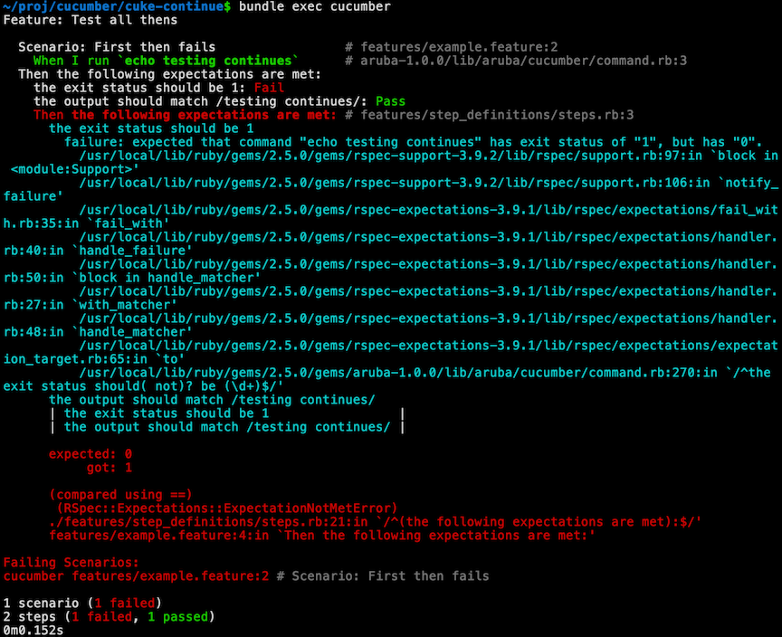

# cuke-continue
How to continue evaluating Thens in cucumber when one fails in a scenario

This demonstrates how to have cucumber perform all Thens in a scenario
using cucumber-ruby. This same concept should be able to be applied to
any cucumber implementation that supports dynamic steps.

# Usage

To run this example:

```
bundle
bundle exec cucumber
```

Output looks like this:



# Improvements

This example could have its reusable code turned into a library.

# License
See the [LICENSE](LICENSE) file.
